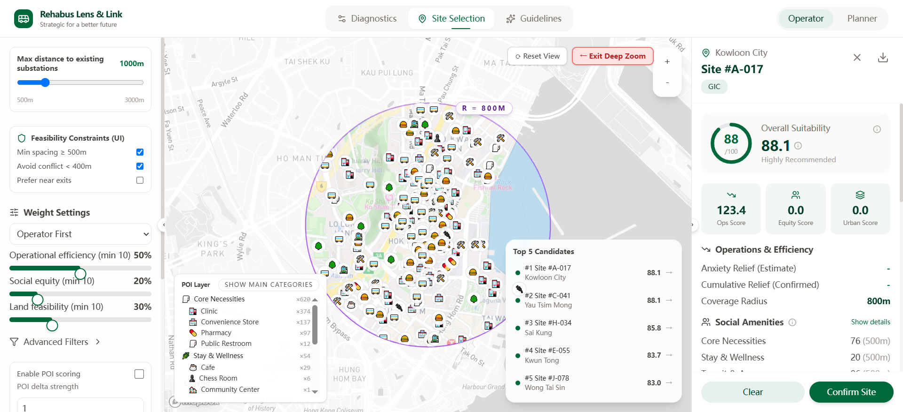

# Rehabus Lens & Link

### An Interactive GIS Platform for Rehabus Mobility & Infrastructure Planning

[](https://chouchou05118.github.io/Rehabus_lens_link/)

Rehabus Lens & Link is an interactive web-based GIS platform that integrates **mobility data, road networks, POIs, demand patterns and infrastructure constraints** into a unified spatial decision-support interface for Rehabus planning and operations.



---

## Overview

Rehabus Lens & Link explores how **digital tools, spatial data and interactive GIS** can support the planning and operation of Rehabus services in Hong Kong.

The platform brings together heterogeneous datasets—including **mobility trajectories, road-network information, POIs, demand patterns and potential infrastructure sites**—and translates them into an interactive web experience.

Instead of presenting transportation analysis as static maps, the platform enables users to **explore spatial relationships, compare candidate sites, evaluate operational conditions and investigate planning scenarios interactively**.

### From Data to Decision

**Multi-source Data → Spatial Analytics → Interactive GIS → Planning Insights**

---

## Key Features

### 01 — Mobility Diagnostics

Explore mobility patterns and operational conditions through an interactive spatial interface.

* Mobility and trajectory visualization
* Demand pattern exploration
* Operational diagnostics
* Spatial identification of mobility hotspots

### 02 — Site Selection

Evaluate potential infrastructure locations using spatial constraints and weighted decision criteria.

* Candidate-site comparison
* Distance-to-substation constraints
* Feasibility constraints
* Operational efficiency scoring
* Social equity considerations
* Land feasibility assessment
* Interactive suitability ranking

### 03 — POI & Accessibility Analysis

Integrate surrounding POIs into the mobility planning workflow.

* Core necessities
* Clinics and healthcare facilities
* Pharmacies
* Convenience stores
* Stay & wellness facilities
* Community services
* Spatial accessibility analysis

### 04 — Planning Guidelines

Translate analytical results into planning-oriented guidance for future Rehabus development.

---

## Multi-source Data Integration

A key design principle of Rehabus Lens & Link is the integration of multiple spatial datasets into a single interactive environment.

```text
                    Mobility Data
                         │
                         ▼
Road Network ───────► Spatial Analysis ◄────── POI Data
                         │
                         ▼
                   Demand Patterns
                         │
                         ▼
                Candidate Site Evaluation
                         │
                         ▼
             ┌─────────────────────────┐
             │   Interactive GIS       │
             │   Decision Platform     │
             └────────────┬────────────┘
                          │
             ┌────────────┴────────────┐
             ▼                         ▼
      Mobility Diagnostics       Site Selection
```

The platform connects:

| Data / Layer          | Application                          |
| --------------------- | ------------------------------------ |
| Mobility trajectories | Mobility and operational analysis    |
| Road network          | Network and accessibility analysis   |
| POIs                  | Service coverage and spatial context |
| Demand patterns       | Demand hotspot identification        |
| Infrastructure data   | Candidate-site evaluation            |
| Spatial constraints   | Feasibility and suitability analysis |

---

## From GIS Analysis to Digital Product

The project was designed not only as a GIS visualization, but as an **interactive spatial data product**.

The workflow transforms:

> **Raw Data → Data Integration → Spatial Analysis → Interactive Visualization → Decision Support**

This approach bridges the gap between technical GIS analysis and practical transportation planning by making complex spatial information **explorable, comparable and actionable**.

---

## Product Design

The interface is designed around two primary user perspectives:

**Operator**

Focuses on operational efficiency, mobility diagnostics and service performance.

**Planner**

Focuses on site selection, spatial constraints, accessibility and infrastructure planning.

The platform therefore combines **analytical depth with an intuitive map-based interface**, allowing different users to investigate the same spatial system from different decision-making perspectives.

---

## Tech Stack

### GIS & Visualization

* Mapbox
* GeoJSON
* Interactive Web Mapping
* Spatial Data Visualization

### Data

* Mobility trajectories
* Road-network data
* POIs
* Demand data
* Infrastructure candidate sites

### Web & Deployment

* HTML / CSS / JavaScript
* Interactive GIS interface
* GitHub Pages

---

## Project Context

This project grew from my research interest in **digital applications in mobility scenarios**, exploring how digital platforms can improve the way transportation data is visualized, interpreted and applied in planning.

It combines my interdisciplinary background across:

**Urban Design × Transportation × GIS × Data × Digital Product**

The project reflects an interest in building digital tools that connect **spatial intelligence with real-world mobility decision-making**.

---

## About Me

### Chu Chu

**Urban Design × Transportation × GIS × Digital Product**

Master of Urban Design and Transportation
The University of Hong Kong

Interested in:

* Digital Mobility
* Transportation & Logistics
* GIS & Spatial Data
* Mobility Data Products
* Smart Transportation
* Interactive Urban Systems

---

## 🚀 Live Demo

Experience the interactive platform:

### [Open Rehabus Lens & Link →](https://chouchou05118.github.io/Rehabus_lens_link/)

---

## Deployment

This project is deployed using GitHub Pages.

The frontend uses relative asset and data paths so that the application can run under a GitHub Pages project URL.

### Mapbox

The application uses a client-side Mapbox public access token. For public deployment, the token should be restricted to the GitHub Pages domain and appropriate usage limits.

### Data

The repository contains a compacted version of the POI dataset used by the web application. Large unused local-demo data files were excluded to comply with GitHub's individual file-size limitations.
